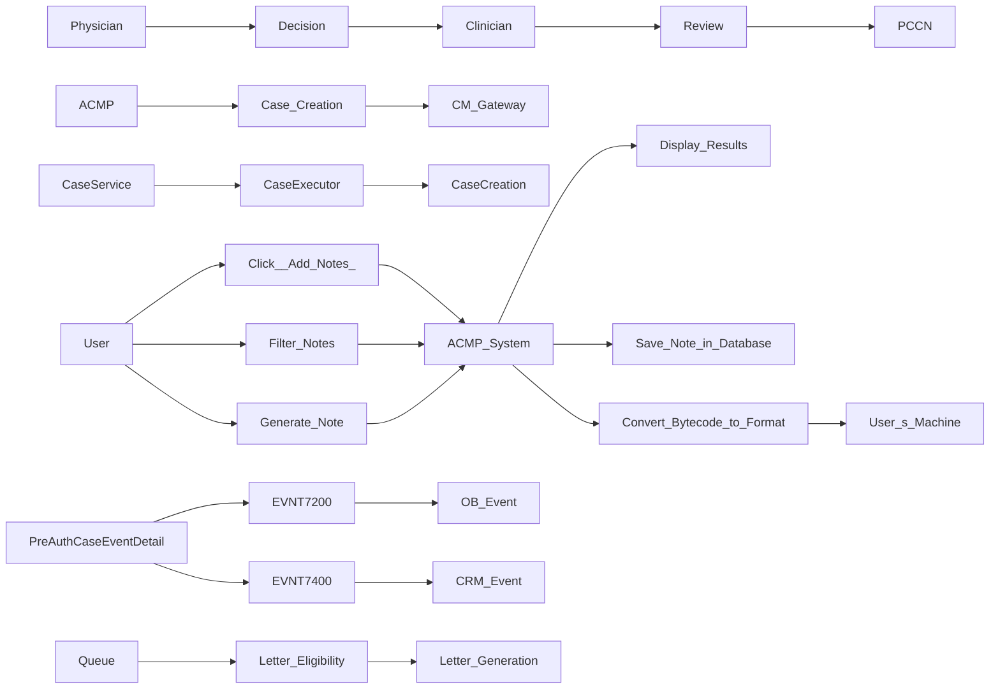

# ACMP Knowledge Transfer & Architecture Summary
**Generated:** 2026-05-21  
**Source parts:** 50 valid extractions

## Software Landscape
Categorized inventory of every software noun extracted across the KT corpus.

```mermaid
flowchart LR
  subgraph Languages_and_Frameworks
    ACMR_database(["ACMR database"])
    ACMRDB(["ACMRDB"])
    Angular(["Angular"])
    CSV_files(["CSV files"])
    DB2(["DB2"])
    Drools(["Drools"])
    Java(["Java"])
    Java_17(["Java 17"])
    JavaScript(["JavaScript"])
    JSON(["JSON"])
    Mainframe(["Mainframe"])
    MangoDB(["MangoDB"])
    Maven(["Maven"])
    Microservices(["Microservices"])
    MongoDB(["MongoDB"])
    Python(["Python"])
    REST(["REST"])
    REST_services(["REST services"])
    RESTful_API(["RESTful API"])
    Service_Oriented_Architecture__SOA_(["Service Oriented Architecture (SOA)"])
    SOAP(["SOAP"])
    SOAP_services(["SOAP services"])
    Spring_Boot(["Spring Boot"])
    SQL_Server(["SQL Server"])
    XML(["XML"])
    XML_schema(["XML schema"])
  end
  subgraph IDEs_and_Editors
    AWS(["AWS"])
    Bamboo_Builds(["Bamboo Builds"])
    Bitbucket(["Bitbucket"])
    Development_environment(["Development environment"])
    Eclipse(["Eclipse"])
    Eclipse_IDE(["Eclipse IDE"])
    Excel(["Excel"])
    IBM_Data_Studio(["IBM Data Studio"])
    IDEA(["IDEA"])
    IntelliJ_IDEA(["IntelliJ IDEA"])
    Legato_Links(["Legato Links"])
    Microsoft_Teams(["Microsoft Teams"])
    PegaCRM(["PegaCRM"])
    Performance_load_test_environment(["Performance load test environment"])
    Postman(["Postman"])
    PowerPoint(["PowerPoint"])
    SOAP_UI(["SOAP UI"])
    SoapUI(["SoapUI"])
    Testing_environment(["Testing environment"])
    Training_environment(["Training environment"])
    User_acceptance_testing_environment(["User acceptance testing environment"])
    Visual_Studio_Code(["Visual Studio Code"])
  end
  subgraph Databases_and_Test_Tools
    DAO_classes[("DAO classes")]
    db_sync_project[("db sync project")]
    DB2[("DB2")]
    Error_table[("Error table")]
    FileNet_System[("FileNet System")]
    Formatter___Validator[("Formatter & Validator")]
    JUnit[("JUnit")]
    Message_tracker_table[("Message tracker table")]
    Mockito[("Mockito")]
    MongoDB[("MongoDB")]
    MongoDB_Compass[("MongoDB Compass")]
    MySQL[("MySQL")]
    ODS_and_OPS411_databases[("ODS and OPS411 databases")]
    PostgreSQL[("PostgreSQL")]
    Postman[("Postman")]
    Prisma[("Prisma")]
    Selenium[("Selenium")]
    Splunk[("Splunk")]
    SQL[("SQL")]
    SQL_queries[("SQL queries")]
    SQL_Server[("SQL Server")]
    Toad_Data_Point[("Toad Data Point")]
    XML[("XML")]
  end
  subgraph Infrastructure_and_Services
    AWS{{"AWS"}}
    AWS_EC2{{"AWS EC2"}}
    AWS_Internal_Das{{"AWS Internal Das"}}
    AWS_S3{{"AWS S3"}}
    Bitbucket{{"Bitbucket"}}
    Dev__UAT__Perf_environments{{"Dev, UAT, Perf environments"}}
    Docker{{"Docker"}}
    FileNet_System{{"FileNet System"}}
    Kubernetes{{"Kubernetes"}}
    Primary_database{{"Primary database"}}
    Prod__Defect_Back{{"Prod, Defect Back"}}
    Replica_server{{"Replica server"}}
    RightFax{{"RightFax"}}
    SOAP_UI{{"SOAP UI"}}
  end
```

## System Relationships
Directed edges are derived from causal system_transitions statements where two known software components co-occur. Arrow direction follows the order described in the source.

## Narrative Summary

# Technical Architecture and Development Overview

## Core Architecture and Languages

The core architecture of the system includes a mix of microservices, REST services, SOAP services, Java, JavaScript, XML, JSON, and Python. The primary languages used are **Java** and **JavaScript**, with additional support from **XML** and **JSON** for data exchange.

| **Core Architecture & Languages** | **Details** |
|---|---|
| Microservices | - |
| REST services | - |
| SOAP services | - |
| Java | - |
| JavaScript | - |
| XML | - |
| JSON | - |
| Python | - |

## Development Environments and IDEs

The development environments and Integrated Development Environments (IDEs) used include IntelliJ IDEA, Eclipse, Visual Studio Code, SoapUI, PowerPoint, Bitbucket, Bamboo Builds, and Microsoft Teams. These tools are essential for developing, testing, and deploying the application.

| **Development Environments & IDEs** | **Details** |
|---|---|
| IntelliJ IDEA | - |
| Eclipse | - |
| Visual Studio Code | - |
| SoapUI | - |
| PowerPoint | - |
| Bitbucket | - |
| Bamboo Builds | - |
| Microsoft Teams | - |

## Databases and Testing Utilities

The databases used include MongoDB, DB2, MySQL, PostgreSQL, SQL Server, and FileNet System. The testing utilities such as JUnit, Mockito, Postman, and Splunk are also utilized for ensuring the application's robustness.

| **Databases & Testing Utilities** | **Details** |
|---|---|
| MongoDB | - |
| DB2 | - |
| MySQL | - |
| PostgreSQL | - |
| SQL Server | - |
| FileNet System | - |
| JUnit | - |
| Mockito | - |
| Postman | - |
| Splunk | - |

## Infrastructure and Deployment

The infrastructure includes AWS, Docker, Kubernetes, RightFax, and AWS Internal Das. The deployment process involves using these tools to ensure the application is scalable, secure, and reliable.

| **Infrastructure & Deployment** | **Details** |
|---|---|
| AWS | - |
| Docker | - |
| Kubernetes | - |
| RightFax | - |
| AWS Internal Das | - |

## Action Items

The following action items have been identified for various components of the system:

1. Implement role-based access control for different user types.
2. Develop a queue management system for case assignment.
3. Integrate LDAP authentication for user logins.
4. Fix the filter issue in SIT-3.
5. Implement additional validation for medical records.
6. Update documentation for new features.
7. Ensure unique authorization identifiers for case creation and updates.
8. Store unique IDs for case updates.
9. Use random IDs for case creation when necessary.
10. Reduce case creation time from 5-10 minutes to less than a minute.

## System Transitions

The following system transitions have been identified:

| **System Transitions** | **Details** |
|---|---|
| ACMP -> Case Creation -> CM Gateway | - |
| User -> Click 'Add Notes' -> ACMP System | - |
| ACMP System -> Convert Bytecode to Format -> User's Machine | - |
| User -> Filter Notes -> ACMP System -> Display Results | - |
| User -> Generate Note -> ACMP System -> Save Note in Database | - |
| PreAuthCaseEventDetail -> EVNT7200 -> OB Event | - |
| PreAuthCaseEventDetail -> EVNT7400 -> CRM Event | - |
| CaseService -> CaseExecutor -> CaseCreation | - |

## Consolidated Action Items

- Implement role-based access control for different user types.
- Develop a queue management system for case assignment.
- Integrate LDAP authentication for user logins.
- Fix the filter issue in SIT-3.
- Implement additional validation for medical records.
- Update documentation for new features.
- Ensure unique authorization identifiers for case creation and updates.
- Store unique IDs for case updates.
- Use random IDs for case creation when necessary.
- Reduce case creation time from 5-10 minutes to less than a minute.

## Conclusion

This technical narrative consolidates the various JSON fragments into a cohesive document, providing an overview of the core architecture, development environments, databases and testing utilities, infrastructure, and action items. The identified components and their interactions are essential for maintaining and enhancing the system's functionality and performance.

## Consolidated Action Items
- Attestation Required
- Contact Mona for local setup
- Decision Review
- Develop a queue management system for case assignment
- Ensure unique authorization identifiers for case creation and updates
- Fix the filter issue in SIT-3
- Implement additional validation for medical records
- Implement error handling for letter generation errors
- Implement role-based access control for different user types
- Integrate LDAP authentication for user logins
- Optimize attribute map calculation
- Reduce case creation time from 5-10 minutes to less than a minute
- Review Details
- Store unique IDs for case updates
- Update documentation for new features
- Use random IDs for case creation when necessary

